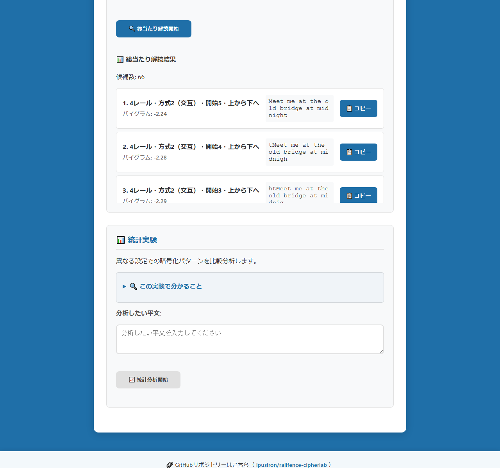
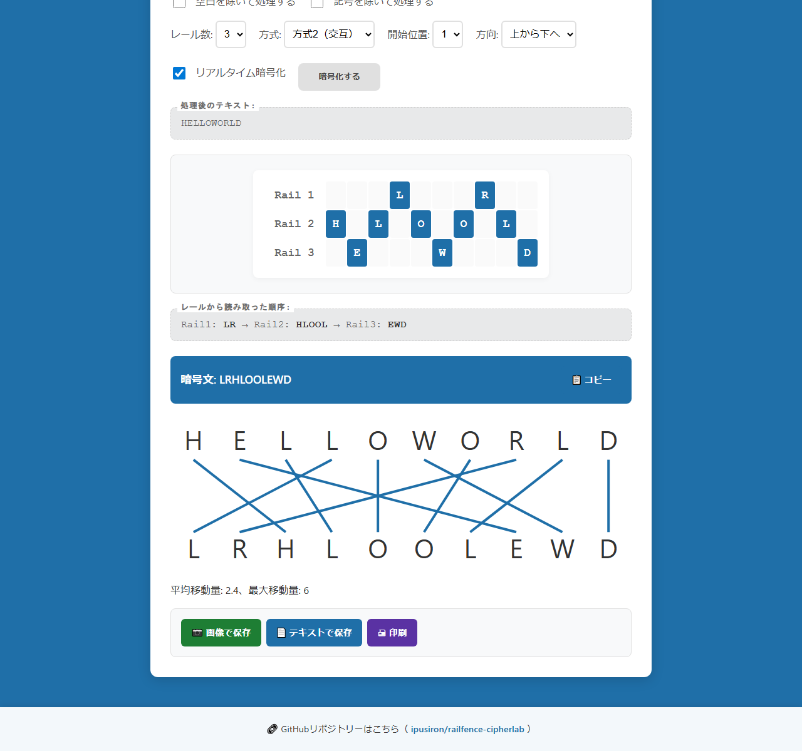

English · [日本語](README.md)

# RailFence CipherLab - Rail Fence Cipher Learning Tool


[](https://ipusiron.github.io/railfence-cipherlab/)

**Day034 - 100 Security Tools Made with Generative AI**

**RailFence CipherLab** is a comprehensive web tool for visually learning the Rail Fence cipher.
Its four tabs—Encrypt, Decrypt, Study, and Lab—cover everything from the basics of classical cryptography to practical cryptanalysis exercises.

---

## 🌐 Live demo

👉 [https://ipusiron.github.io/railfence-cipherlab/](https://ipusiron.github.io/railfence-cipherlab/)

---

## 📸 Screenshots

> 
>
> *Japanese Encrypt tab: Sample 1, three rails, Method 2 (zigzag), with the grid and ciphertext `Hoo!el,wrdl l`.*

> 
>
> *Japanese Decrypt tab: Sample 2 decrypted with three rails and Method 1, showing the original Japanese plaintext and rail layout.*

> 
>
> *English Study tab: Method 1 and Method 2 examples for `HELLO` with three rails.*

> 
>
> *Japanese Lab tab: the `Meet me at the old bridge at midnight` ciphertext, all offset and direction variants, and the highest-ranked bigram candidates.*

> 
>
> *Japanese Encrypt tab: `HELLOWORLD`, three zigzag rails, start position 1, with plaintext-to-ciphertext mapping and movement statistics.*

---

## 🎯 Intended audience

This tool is intended for the following users.

| Audience | Description |
|---|---|
| 🔰 Beginners | People who want hands-on experience with basic cryptographic concepts, particularly as an introduction to transposition ciphers |
| 👩‍🏫 Educators and instructors | Educators looking for visual cipher demonstrations for security and information-literacy classes, including live classroom demonstrations |
| 🧑‍🎓 CTF participants | People learning how transposition ciphers work and practicing basic cryptanalysis, including brute-force approaches |
| 🛠️ Security enthusiasts | Hobbyists and hackers interested in the structure and weaknesses of classical ciphers, or building their own cryptanalysis tools |
| 📖 Independent learners | People who want to supplement books and online materials with hands-on practice; the tool also supports English-speaking learners |

### 🧠 Why these features suit the audience

- **Intuitive operation**: A visual interface that is easy to navigate
- **Visible structure**: Shows the flow from plaintext to ciphertext
- **Deeper understanding**: The Study tab explains mechanisms and weaknesses
- **Flexible experiments**: Supports realistic strings, including Japanese, symbols, and spaces
- **CTF preparation**: Introduces the idea of brute-force cryptanalysis

---

## 📖 About the Rail Fence cipher

### 🎯 Overview

The Rail Fence cipher is a classical **transposition cipher**. It encrypts a message by arranging its characters across rails and changing their order.

Its name comes from the rail-fence-like pattern formed by the characters.

Because the arrangement resembles a fence, it is also referred to as a fence-shaped cipher in Japanese.

### 📜 Historical background

- **Ancient origins**: Possibly used in ancient Greece and Rome
- **Military use**: Used in military communications during the nineteenth and early twentieth centuries
- **Private correspondence**: Also widely used for personal secret messages
- **Educational material**: Now an important introductory example in cryptography

It was a common method in the early history of cryptography, but fell out of use as more complex systems emerged, such as medieval nomenclators and fifteenth- and sixteenth-century codebooks.

It experienced a modest revival during the American Civil War, when both Confederate and Union forces used Rail Fence ciphers to conceal military communications.

### ⚙️ How it works

1. **Place the characters**: Distribute the plaintext across multiple rails (rows).
2. **Read the rails**: Read the characters from each rail in order.
3. **Build the ciphertext**: Concatenate them in that reading order.

Place `HELLO` on three rails using **Method 1 (sequential)**.

```text
H . . L .    →  HL
. E . . O    →  EO
. . L . .    →  L
Result: HLEOL
```

**Method 2 (zigzag)** produces the following layout.

```text
H . . . O    →  HO
. E . L .    →  EL
. . L . .    →  L
Result: HOELL
```

### 🔍 Examples and applications

| Period or field | Use | Characteristics |
|---|---|---|
| **Classical era** | Military and diplomatic communications | Requires only paper and a pen |
| **Nineteenth–twentieth centuries** | Telegraph and radio communications | Concealed communication using short ciphertexts |
| **Today** | Education and learning | Introduces fundamental cryptographic concepts |
| **CTF competitions** | Challenges and cryptanalysis exercises | A common classical-cipher challenge |

### 🔄 Variants

1. **Sequential placement (Method 1)**
   - Distributes characters to each rail in turn
   - Equivalent to **columnar transposition** in its basic operation
2. **Zigzag placement (Method 2)**
   - Places characters while moving down and back up
   - Produces a more complex transposition pattern
3. **Irregular rail counts**
   - Adds complexity through variable rail counts
   - Changes rails according to position
4. **Offset placement**
   - Shifts the starting position
   - Adds further variations

### 🔗 Relationship to other ciphers

| Cipher | Similarities | Differences |
|---|---|---|
| **Columnar transposition** | Same underlying transposition principle | Whether the rail concept is used |
| **Simple substitution** | Classical and calculable by hand | Transposition versus substitution |
| **Caesar cipher** | Introductory educational cipher | Shifting versus transposition |
| **Vigenère cipher** | Concepts from polyalphabetic cryptography | Polyalphabetic versus geometric |

### 🛡️ Security strength

#### Factors affecting strength

- **Rail count**: More rails make the layout more complex (typically two to six rails)
- **Message length**: Length does not increase the number of keys (rail count and method). Longer messages make the correct plaintext easier to recognize among brute-force candidates
- **Method choice**: The zigzag method is somewhat more complex
- **Language characteristics**: Japanese can be harder to decipher than English

#### Weaknesses

- **Small key space**: Rail counts multiplied by methods yield only a limited number of combinations
- **Frequency analysis**: Character frequencies are preserved
- **Pattern inference**: Short messages may reveal the placement pattern
- **Brute-force attacks**: Modern computers can try the possibilities in seconds

### 🎯 Common cryptanalysis techniques

1. **Brute-force attacks**
   - Try every combination of rail count and method
   - Evaluate results for readability
2. **Frequency analysis**
   - Compare character frequencies with those of the language
   - Use statistical methods to narrow the possibilities
   - Because this is a transposition cipher, frequencies match those of the plaintext unless dummy or redundant characters are added. A ciphertext distribution close to that of the target language therefore suggests a transposition cipher.
3. **Dictionary attacks**
   - Match patterns against known words
   - Identify substrings
4. **Contextual inference**
   - Infer meaning from partially deciphered text
   - Apply human intuition

### 💡 Educational value

- **Introduction to cryptography**: Understand the basics of transposition
- **Visual understanding**: Observe a geometric encryption process
- **Security awareness**: Recognize the limitations of classical ciphers
- **Algorithmic thinking**: Understand a procedure logically
- **CTF preparation**: Practice classical-cipher challenges

### 🎬 The Rail Fence cipher in fiction

Rail Fence ciphers also appear as cryptographic puzzles in detective and mystery fiction.

#### Detective Conan: Hotel Serial Bombing Case

- **Original manga**: FILE 1094–1096, collected in volume 103 of 『名探偵コナン』 (Japanese manga/anime)
- **Anime**: Episodes 1144 and 1145, 「ホテル連続爆破事件」 (Hotel Serial Bombing Case), Parts 1 and 2

In this story, Conan and his companions decipher three messages left at a hotel by a serial bomber. Each message is a sequence of hiragana characters with the first character enclosed in a square (□).

The story reveals that the messages use a Rail Fence cipher. The boxed hiragana corresponds to an alphabetic key on a Japanese keyboard. Arranging the characters in a zigzag following that letter's shape (W, M, or V) identifies the room number where a bomb has been planted.

The puzzle combines the zigzag principle of the Rail Fence cipher with a keyboard layout, making it an interesting applied example for learning about ciphers.

---

## 🔧 Main features and organization

### 🔐 Encrypt tab

- **Plaintext input**: Arbitrary strings, including Latin letters, Japanese, symbols, spaces, and line breaks
- **Samples**: Load English or Japanese learning examples with one click
  - Sample 2, `アス　ゴゴロクジニ　ヨコハマエキニシグチニ　シュウゴウ`, uses the plaintext on p. 656 of 『暗号事典』, published by Kenkyusha (Japanese-language book)
- **Real-time processing**
  - Encrypts as you type when real-time mode is enabled
  - Character limit and graduated warnings, with a 500-character maximum
  - Detects and reports symbols, spaces, and line breaks
- **Preprocessing options**
  - Remove spaces
  - Remove symbols
- **Rail settings**
  - Two to six rails, selected from a dropdown
  - Method 1: Sequential placement (columnar transposition)
  - Method 2: Zigzag placement
- **Visualization**
  - Colorful rail grid
  - Animated character placement with adjustable speed
  - Detailed intermediate states
- **Export**
  - 📷 Save the rail layout as a PNG image
  - 📄 Save settings and results as text
  - 🖨 Print

---

### 🔓 Decrypt tab

- **Ciphertext input**: Enter a message to decrypt
- **Settings synchronization**: Import settings and ciphertext from the Encrypt tab
- **Samples**: Load sample ciphertexts with one click
- **Real-time decryption**: Decrypt as you type
- **Visual decryption process**
  - Visualize the restoration of plaintext from the rail layout
  - Animate the process step by step
- **Character limit**: The same limits and warning system as the Encrypt tab
- **Export**: Save or print decryption results

---

### 📚 Study tab

- **Fundamentals**: History and overview of the Rail Fence cipher
- **Method details**: Visual explanations of the differences between Methods 1 and 2
- **Security analysis**
  - Factors associated with the cipher: rail count, message length, and method
  - Weaknesses: frequency analysis, key space, and brute-force attacks
- **Attacks and defenses**
  - Attack techniques: brute force, frequency analysis, dictionary attacks, and contextual inference
  - Ways to modify the scheme, such as combining ciphers or inserting dummy characters
- **Learning guide**: Effective learning steps and ways to use the tool
- **Toward modern cryptography**: Connections to modern techniques such as public-key cryptography

---

### 🧪 Lab tab

- **Brute-force experiment**
  - Automatically decrypt with different rail counts and methods
  - Evaluate and rank results using readability scores
  - Read an explanation of the scoring method
- **Statistics experiment**
  - Compare encryption effects under different settings
  - Quantify character movement and changes in entropy
  - Show settings with larger movement distances, which are not a measure of security
  - Entropy change is always zero because transposition preserves character counts

---

## 🎮 How to use

### Basic workflow

1. **Prepare**: Learn the basics in the Study tab.
2. **Try encryption**: Experiment with sample messages in the Encrypt tab.
3. **Understand decryption**: Explore the reverse process in the Decrypt tab.
4. **Practice**: Try brute-force attacks and statistical analysis in the Lab tab.
5. **Explore**: Use your own messages and compare different settings.

### 💡 Tips for effective learning

- **Use animation**: Watch character placement in slow motion
- **Compare settings**: Encrypt the same message with different settings
- **Try brute force**: Explore how deciphering a short ciphertext works
- **Analyze statistics**: Understand the effects of encryption through numbers

---

## ⚠️ Notes and limitations

- **Educational use only**: Not suitable for protecting real information
- **Cipher strength**: Rail Fence is weak by modern standards
- **Storage**: Only the language preference is saved in localStorage; inputs and results are not saved
- **Offline operation**: No internet connection required
- **Browser support**: Modern Chrome, Firefox, Safari, or Edge recommended

---

## 🔧 Technical specifications

### Frontend technologies

- **HTML5**: Semantic markup
- **CSS3**
  - CSS Grid Layout for rail visualization
  - CSS animations for character placement
  - Responsive design
- **JavaScript (ES6+)**
  - Code separated by responsibility
  - Canvas API for image export
  - Web APIs for clipboard access and downloads

### Encryption algorithms

- **Method 1 (sequential)**: Basic columnar-transposition operation
- **Method 2 (zigzag)**: Transposition along a zigzag pattern
- **Parameters**: Two to six rails and two placement methods

### Performance

- **Character limit**: 500 characters, optimized for educational use
- **Animation**: Supports 60 fps and adjustable speed
- **Responsive layout**: Operable from 320px wide; only the rail diagram scrolls horizontally inside its container

---

## 🔬 Specification and known answers

Encrypt, Decrypt, and Lab all calculate results through the shared, DOM-independent `js/railfence-core.js`.
Method 1 (`sequential`) assigns characters to rails 1→2→3→1…, while Method 2 (`zigzag`) reverses direction at the outer rails.
`pattern` returns a zero-based array of rail indices. For `HELLO` with three rails, the patterns are `01201` and `01210`, respectively.

Preprocessing removes line breaks. Removing spaces and removing symbols are independent options; removing symbols does not remove spaces.
For example, applying only symbol removal to `a b,c` produces `a bc`.
Characters are processed as Unicode code points, so the emoji in `AB😀CD` occupies one character position. A single visible character composed of combining marks or ZWJ sequences may consist of multiple code points.

| Plaintext | Rails | Method | Ciphertext |
|---|---|---|---|
| `HELLO` | 3 | sequential | `HLEOL` |
| `HELLO` | 3 | zigzag | `HOELL` |
| `Hello, world!` | 3 | sequential | `Hl r!eowll,od` |
| `Hello, world!` | 3 | zigzag | `Hoo!el,wrdl l` |
| `WEAREDISCOVEREDRUNATONCE` | 3 | zigzag | `WECRUOERDSOEERNTNEAIVDAC` |

The last row is the example in English Wikipedia's “[Rail fence cipher](https://en.wikipedia.org/wiki/Rail_fence_cipher)” article.
That article separates the rails with spaces, displaying `WECRUO ERDSOEERNTNE AIVDAC`.

The two previous sample ciphertexts in the Decrypt tab did not restore their original plaintexts. They have been corrected to use three rails, Method 1, and no removal options; tests verify round trips with the Encrypt tab samples.

Use the header button to switch between Japanese and English.
Language selection follows `?lang=ja|en`, the saved preference, and then the browser language. Switching preserves the active tab, input, settings, results, and animation position.

## 🎯 Use cases

Ways of using this tool in particular

- Confirming that it is a transposition, so letters stay and only positions change (transposition-cipher classes): encrypting WEAREDISCOVERED with 3 rails keeps the letters and rearranges them into WRIOREESVEADCED, and decrypting with the same number of rails returns the original. You can confirm, in the rearrangement of writing in a zigzag and reading by row, that it is a transposition that swaps positions rather than replacing letters
- Confirming that 1 rail leaves the plaintext and the rails change the order (key classes): with 1 rail the ciphertext is the plaintext, and more rails change the order. The key is a single small number, the rail count, so you can confirm that the possible keys are few
- Confirming that you can solve it by brute force without knowing the rails (cryptanalysis classes): even without the key (the rails), trying all of 2 to 6 rails and ranking by how English the result is puts the correct 3 rails first and returns WEAREDISCOVEREDFLEEATONCE. You can confirm that a transposition has few candidate keys and is easy to solve by brute force

General uses

- Learn how the Rail Fence cipher (a transposition) works in class or self-study
- Make or read transposition ciphertext keyed by the rail count in puzzles and CTFs
- Use it as material to explain the difference between transposition and substitution (changing positions versus changing letters)

## 🔒 Tool security

Input is processed in the browser and is not transmitted externally. The application uses no external APIs, CDNs, fonts, or dependency libraries.
Its CSP restricts scripts and styles to the same origin. Rendering uses no inline event handlers, style attributes, or HTML strings.
The only localStorage entry is the language preference, `railfence-language`; the tool also works when storage is blocked.

Clipboard writes, file saves, and printing occur only after button operations.
This is a classical-cipher learning tool, not a way to protect confidential data.

## 🧪 Tests

Run the following with Node.js 22. No dependency installation is required.

```sh
npm test
```

| File | Checks |
|---|---|
| `test/core.test.js` | 14 known-answer rows, two samples, eight preprocessing cases, and 410 round trips |
| `test/core2.test.js` | Extended keys, movement, brute force, the frequency table, and transposition checks |
| `test/format.test.js` | Maximum lines of 160 characters for JS/CSS/tests and 250 for HTML, plus minimum file lengths |
| `test/html.test.js` | CSP, ARIA, prohibited constructs, core calls, and samples |
| `test/i18n.test.js` | Matching keys, placeholders, references, Japanese literals, and language priority |
| `test/contrast.test.js` | Nine CSS-variable color pairs at or above 4.5:1 |
| `test/readme.test.js` | Known answers, headings, trees, images, and YAML in both READMEs |

GitHub Actions runs `npm test` on both push and pull_request events.

## 📁 Directory structure

```text
railfence-cipherlab/            # Project root
├── .claude/                    # Claude Code configuration
│   └── CLAUDE.md               # English guidance for Claude Code
├── .github/                    # GitHub configuration
│   └── workflows/              # GitHub Actions workflows
│       └── test.yml            # Run npm test on push and pull_request
├── assets/                     # Images
│   ├── en/                     # English screenshots
│   │   └── screenshot.png      # Study tab: both method examples
│   ├── screenshot.png          # Encrypt tab: zigzag, three rails
│   └── screenshot2.png         # Decrypt tab: restored Sample 2
│   ├── screenshot3.png         # Lab tab: extended-key brute-force results
│   └── screenshot4.png         # Encrypt tab: character-position mapping
├── js/                         # Scripts
│   ├── common.js               # Tabs, warnings, clipboard, toasts, and help
│   ├── decrypt.js              # Decrypt tab UI
│   ├── encrypt.js              # Encrypt tab UI
│   ├── i18n.js                 # Japanese/English dictionaries and switching
│   ├── lab.js                  # Lab tab UI
│   ├── railfence-bigrams.js    # Generated English bigram frequency table
│   └── railfence-core.js       # DOM-independent cipher operations
├── test/                       # Automated tests using node --test
│   ├── contrast.test.js        # Color contrast ratios
│   ├── core.test.js            # Cipher known answers and round trips
│   ├── core2.test.js           # Extended key, movement, scoring, and transposition checks
│   ├── format.test.js          # Maximum line and minimum file lengths
│   ├── html.test.js            # CSP, ARIA, and prohibited constructs
│   ├── i18n.test.js            # Dictionary keys and Japanese literals
│   └── readme.test.js          # README answers, structure, and images
├── .gitignore                  # Files excluded from Git
├── .nojekyll                   # Disable Jekyll on GitHub Pages
├── LICENSE                     # MIT license
├── README.en.md                # English documentation
├── README.md                   # Japanese documentation
├── index.html                  # Four-tab interface
├── package.json                # Dependency-free npm test configuration
└── style.css                   # Styles
```

## 💻 Runtime environment

The tool targets modern browsers such as Chrome, Edge, Firefox, and Safari. Classic scripts allow both direct `file://` access to `index.html` and local HTTP hosting.
HTTP and file:// behavior has been verified in Chromium. Clipboard availability depends on browser permissions, and printing may require pop-up permission.
Tabs and controls wrap on smartphones. Checkboxes remain 20px square, with a clickable area of at least 44px including their labels.

## 📄 License

MIT License — see [LICENSE](LICENSE) for details.

---

## 🛠️ About this tool

This tool was developed as part of the “100 Security Tools Made with Generative AI” project. The project uses AI assistance to create and publish a variety of security-related tools over 100 days.

For project details and other tools, visit the following page.

🔗 [https://akademeia.info/?page_id=42163](https://akademeia.info/?page_id=42163)
