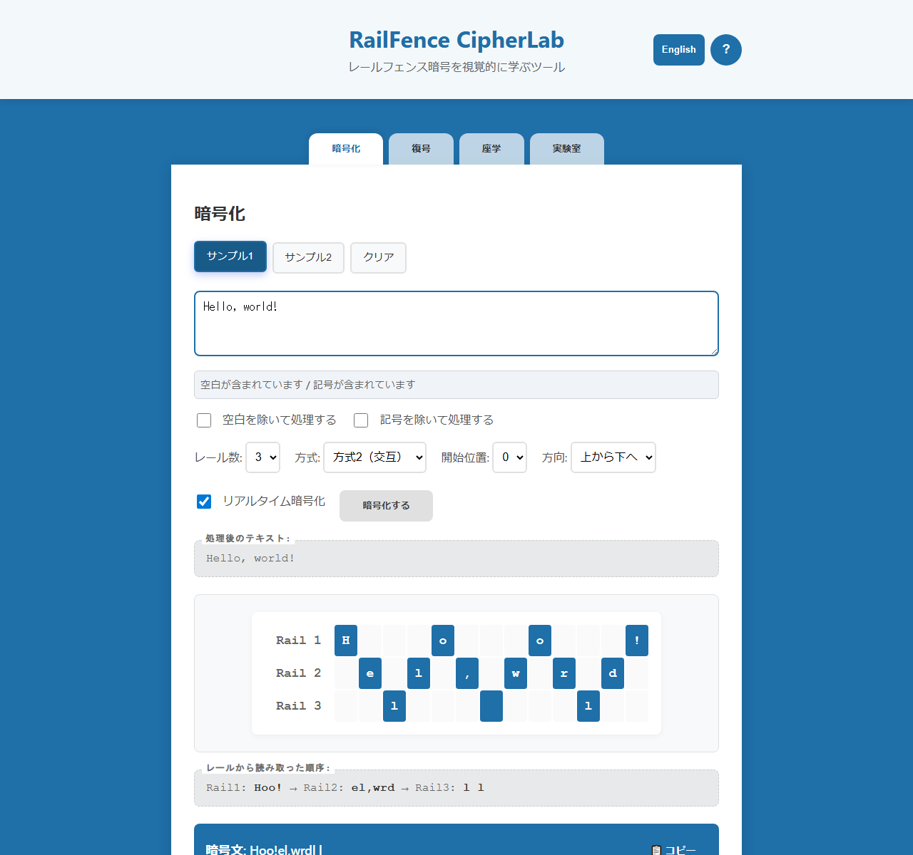
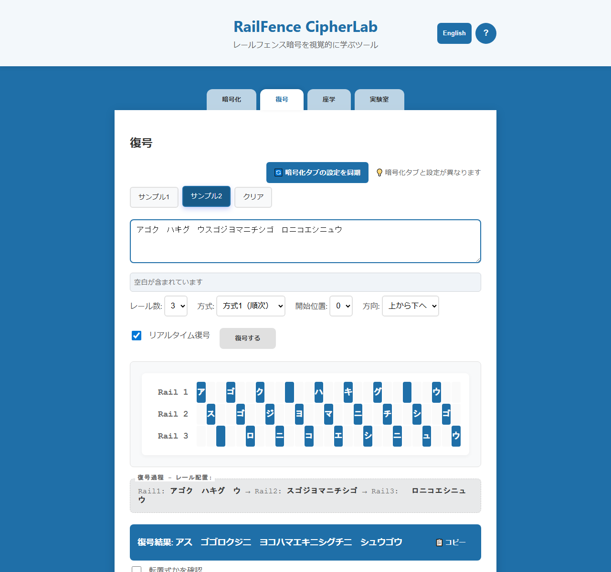
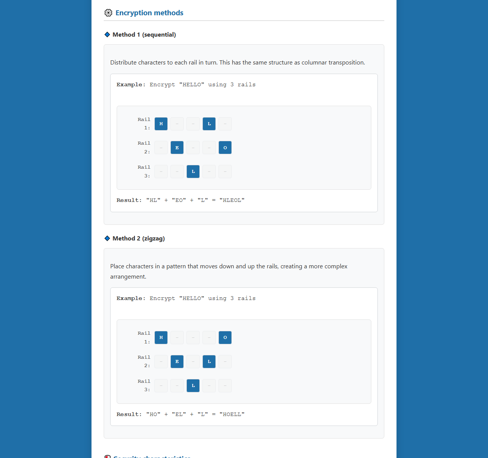

[English](README.en.md) · 日本語

<!--
---
id: day034
slug: railfence-cipherlab

title: "RailFence CipherLab"

subtitle_ja: "レールフェンス暗号学習ツール"
subtitle_en: "Rail Fence Cipher Learning Tool"

description_ja: "レールフェンス暗号を視覚的に学べる包括的なWebツール。暗号化・復号・座学・実験室の4タブ構成で、古典暗号の理解から実践的な解読演習まで幅広くサポートします。"
description_en: "A comprehensive web tool for visually learning the Rail Fence cipher. Features 4 tabs (Encrypt, Decrypt, Study, Lab) supporting everything from understanding classical cryptography to practical decryption exercises."

category_ja:
  - 古典暗号
  - 転置式暗号
category_en:
  - Classical Cryptography
  - Transposition Cipher

difficulty: 1

tags:
  - rail-fence-cipher
  - visualization
  - ctf
  - education

repo_url: "https://github.com/ipusiron/railfence-cipherlab"
demo_url: "https://ipusiron.github.io/railfence-cipherlab/"

hub: true
---
-->

# RailFence CipherLab - レールフェンス暗号学習ツール


[](https://ipusiron.github.io/railfence-cipherlab/)

**Day034 - 生成AIで作るセキュリティツール100**

**RailFence CipherLab** は、レールフェンス暗号を視覚的に学べる包括的なWebツールです。
暗号化・復号・座学・実験室の4タブ構成で、古典暗号の理解から実践的な解読演習まで幅広くサポートします。

---

## 🌐 デモページ

👉 [https://ipusiron.github.io/railfence-cipherlab/](https://ipusiron.github.io/railfence-cipherlab/)

---

## 📸 スクリーンショット

> 
>
> *サンプル1を3レール・方式2（ジグザグ）で暗号化。図と暗号文`Hoo!el,wrdl l`を表示。*

> 
>
> *サンプル2を3レール・方式1で復号。元の日本語の平文とレール配置を表示。*

> 
>
> *英語の座学タブ。`HELLO`を3レールで処理する方式1・方式2の例。*

---

## 🎯 対象ユーザー（ターゲット）

本ツールは以下のようなユーザーを対象としています。

| タイプ | 説明 |
|--------|------|
| 🔰 初学者 | 暗号の基本概念を体験的に学びたい人。特に転置式暗号（転置暗号）の入門教材として有効 |
| 👩‍🏫 教育者・講師 | セキュリティや情報リテラシーの授業で暗号の可視化教材を探している教育関係者。授業内実演にも適しています。 |
| 🧑‍🎓 CTF参加者 | 転置式暗号の仕組みを理解し、解読演習の基礎訓練を行いたい人。総当たりアプローチの実践学習にも最適です。 |
| 🛠️ セキュリティ愛好家 | 古典暗号の構造や脆弱性に興味を持つホビイスト・ハッカー層。自作解読ツール開発の参考にもなります。 |
| 📖 自学者 | 書籍やWeb教材と併用し、実際に手を動かして理解を深めたい自主学習者。英語圏を含む幅広い学習者に対応しています。 |

### 🧠 本ツールの特徴がターゲットに訴求する理由

- **操作が直感的**：ビジュアルUIで迷わず使える
- **構造が見える**：平文から暗号文への流れを視覚化
- **知識が深まる**：座学タブで仕組みや弱点も学べる
- **試せる自由度**：日本語・記号・空白など現実的な文字列も扱える
- **CTF対策にも**：総当たり解読の考え方に触れられる

---

## 📖 レールフェンス暗号について

### 🎯 概要

レールフェンス暗号（Rail Fence Cipher）は、**転置式暗号** の一種で、平文の文字を鉄道のレール状に配置して並び順を変えることで暗号化する古典暗号です。

その名前は、文字の配置パターンが鉄道のレール（rail fence）に似ていることに由来します。

また、柵のような形をしていますので、柵型暗号と呼ばれることもあります。

### 📜 歴史的背景

- **古代起源**：古代ギリシャ・ローマ時代から使用されていた可能性
- **軍事利用**：19世紀から20世紀初頭にかけて軍事通信で活用
- **手紙暗号**：個人間の秘密通信でも広く使用
- **教育教材**：現代では暗号学の入門教材として重要な位置

暗号史の黎明期では一般的な方法でしたが、中世のノーメンクレイター、15世紀と16世紀のコードブックなど、より複雑な方法が登場することで、レールフェンス暗号は廃れました。

しかし、アメリカの南北戦争の際に、多少息を吹き返し、南軍・北軍の両陣営が軍事通信を秘匿するためにレールフェンス暗号を使ったことがわかっています。

### ⚙️ 基本的な仕組み

1. **文字配置**：平文を複数のレール（行）に分けて配置
2. **読み取り**：各レールから順番に文字を読み取り
3. **暗号文生成**：読み取った順序で文字を連結して暗号文を作成

**方式1（順次）**で`HELLO`を3レールに配置します。

```
H . . L .    →  HL
. E . . O    →  EO
. . L . .    →  L
結果：HLEOL
```

**方式2（ジグザグ）**では次の配置になります。

```
H . . . O    →  HO
. E . L .    →  EL
. . L . .    →  L
結果：HOELL
```

### 🔍 使用例と用途

| 時代・分野 | 用途 | 特徴 |
|------------|------|------|
| **古典時代** | 軍事・外交通信 | 紙とペンだけで実行可能 |
| **19-20世紀** | 電信・無線通信 | 短い暗号文での秘匿通信 |
| **現代** | 教育・学習 | 暗号学の基礎概念習得 |
| **CTF競技** | 問題・解読演習 | 古典暗号分野の定番問題 |

### 🔄 暗号の亜種・バリエーション

1. **順次配置（方式1）**
   - 文字を順番に各レールに割り振り
   - **縦列転置暗号と同等**の処理

2. **ジグザグ配置（方式2）**
   - 上下に蛇行しながら文字を配置
   - より複雑な転置パターン

3. **変則レール数**
   - 可変レール数による複雑化
   - 位置依存のレール変更

4. **オフセット配置**
   - 開始位置をずらした配置
   - さらなるバリエーション増加

### 🔗 他の暗号との関係

| 暗号種類 | 類似点 | 相違点 |
|----------|--------|--------|
| **縦列転置暗号** | 転置の基本原理が同一 | レール概念の有無 |
| **単純置換暗号** | 古典暗号、手計算可能 | 転置 vs 置換（換字）の違い |
| **カエサル暗号** | 教育用入門暗号 | シフト vs 転置 |
| **ヴィジュネル暗号** | 多表式暗号の概念 | 多表式vs幾何学的 |

### 🛡️ セキュリティ強度

#### 強度の要因
- **レール数**：多いほど複雑（一般的に2〜6レール）
- **文字長**：鍵（レール数と方式）の数は文の長さでは増えない。長い文ほど、総当たりの候補から正しい文を見分けやすい
- **方式選択**：ジグザグ方式がやや複雑
- **言語特性**：日本語は英語より解読困難

#### 脆弱性
- **小さな鍵空間**：レール数×方式＝限定的な組み合わせ
- **頻度分析**：文字の出現頻度は保持される
- **パターン推測**：短文では配置が推測可能
- **総当たり攻撃**：現代では数秒で解読可能

### 🎯 典型的な解読手法

1. **総当たり攻撃**
   - 全レール数・方式組み合わせを試行
   - 可読性による結果評価

2. **頻度分析**
   - 言語の文字出現頻度と照合
   - 統計的手法による絞り込み
   - 転置式暗号という特性上、ダミー文字や冗字がなければ、平文の頻度分布と合致する。そのため「暗号文の頻度分布」と「対象言語の頻度分布」とほぼ同じであれば、転置式暗号文と推定される。

3. **辞書攻撃**
   - 既知単語とのパターンマッチング
   - 部分文字列の特定

4. **文脈推測**
   - 部分解読結果からの推測
   - 人間の直感的判断

### 💡 教育的価値

- **暗号学入門**：転置暗号の基礎理解
- **視覚的理解**：幾何学的な暗号化過程
- **セキュリティ意識**：古典暗号の限界認識
- **アルゴリズム思考**：手順の論理的理解
- **CTF準備**：古典暗号問題への対策

### 🎬 フィクションに登場するレールフェンス暗号

レールフェンス暗号は、推理・ミステリー作品の暗号トリックとしても取り上げられています。

#### 名探偵コナン「ホテル連続爆破事件」

- **原作**：FILE 1094〜1096（単行本103巻収録）
- **アニメ**：第1144話・1145話「ホテル連続爆破事件」（前編・後編）

連続爆破犯がホテルに残した3つの暗号を、コナンたちが解読するエピソードです。暗号はひらがなの羅列で、先頭の文字が□（四角）で囲まれている形式になっています。

作中では、この暗号が「レールフェンス暗号」であることが明かされます。□で囲まれたひらがなはキーボード上のアルファベットキーに対応しており、そのアルファベットの形状（W型・M型・V型）に沿って文字をジグザグに並べることで、爆弾が仕掛けられた部屋番号を特定できるという仕掛けです。

レールフェンス暗号のジグザグ配置の原理と、キーボード配列を組み合わせた応用的な暗号パズルとなっており、暗号学習の題材としても興味深い内容です。

---

## 🔧 主な機能と構成

### 🔐 暗号化タブ

- **平文入力**：任意の文字列（アルファベット・日本語・記号・空白・改行すべて対応）
- **サンプル機能**：学習用のサンプル文章（英語・日本語）をワンクリック読み込み
  - サンプル2（「アス　ゴゴロクジニ　ヨコハマエキニシグチニ　シュウゴウ」）は、『暗号事典』（研究社刊）P.656に掲載されている平文を採用。
- **リアルタイム処理**：
  - 入力と同時に暗号化を実行するリアルタイムモード
  - 文字数制限と警告表示（500文字上限、段階的警告）
  - 記号・空白・改行の存在を自動検出・通知
- **オプション設定**：
  - 空白を除いて処理する
  - 記号を除いて処理する
- **レール設定**：
  - レール数：2〜6（プルダウン）
  - 方式選択：
    - 方式1：順次配置（縦列転置暗号）
    - 方式2：ジグザグ配置（蛇行構造）
- **視覚化機能**：
  - カラフルなレールグリッド表示
  - 文字配置過程のアニメーション（速度調整可能）
  - 中間状態の詳細表示
- **エクスポート機能**：
  - 📷 レール配置の画像保存（PNG形式）
  - 📄 設定と結果のテキスト保存
  - 🖨 印刷機能

---

### 🔓 復号タブ

- **暗号文入力**：復号したい暗号文の入力
- **設定同期**：暗号化タブの設定と暗号文を自動取得
- **サンプル機能**：学習用のサンプル暗号文をワンクリック読み込み
- **リアルタイム復号**：入力と同時に復号を実行
- **視覚的復号過程**：
  - レール配置から平文復元までを可視化
  - アニメーション機能で復号過程を段階表示
- **文字数制限**：暗号化タブと同様の制限・警告システム
- **エクスポート機能**：復号結果の保存・印刷

---

### 📚 座学タブ

- **基礎知識**：レールフェンス暗号の歴史と概要
- **方式詳細**：方式1と方式2の違いを視覚的に解説
- **セキュリティ分析**：
  - 暗号化強度の要因（レール数、文字長、方式）
  - セキュリティの弱点（頻度分析、鍵空間、総当たり攻撃）
- **攻撃と防御**：
  - 攻撃者の手法（総当たり、頻度分析、辞書攻撃、文脈推測）
  - 防御の改善方法（他暗号との組み合わせ、ダミー文字挿入等）
- **学習ガイド**：効果的な学習手順とツール活用法
- **現代暗号学への発展**：公開鍵暗号など現代技術との関連性

---

### 🧪 実験室タブ

- **総当たり解読実験**：
  - さまざまなレール数・方式で復号を自動試行
  - 可読性スコアによる結果の自動評価・ランキング
  - スコアリング方式の詳細説明
- **統計実験**：
  - 異なる設定での暗号化効果を比較分析
  - 文字の移動距離とエントロピー変化を数値化
  - 移動距離が大きい設定を表示（安全さの指標ではない）
  - 転置では文字の出現回数が変わらないため、エントロピー変化は常に0

---

## 🎮 使い方

### 基本的な操作手順

1. **学習準備**：座学タブでレールフェンス暗号の基礎を学習
2. **暗号化体験**：暗号化タブでサンプル文章を使って操作を体験
3. **復号理解**：復号タブで逆向きの処理を理解
4. **実践演習**：実験室タブで総当たり攻撃や統計分析を体験
5. **応用学習**：自分なりの文章でさまざまな設定を試行

### 💡 効果的な学習のコツ

- **アニメーション活用**：文字配置過程をスローモーションで観察
- **設定比較**：同じ文章を異なる設定で暗号化して違いを確認
- **総当たり体験**：短い暗号文で解読の困難さを実感
- **統計分析**：数値で暗号化効果を客観的に理解

---

## ⚠️ 注意事項・制限

- **教育目的専用**：実際のセキュリティ用途には使用できません
- **暗号強度**：レールフェンス暗号は現代では脆弱な暗号方式です
- **データ保存**：localStorageに保存するのは言語の設定だけ。入力と結果は保存しない
- **オフライン動作**：インターネット接続不要で動作します
- **ブラウザー対応**：モダンブラウザー（Chrome, Firefox, Safari, Edge）推奨

---

## 🔧 技術仕様

### フロントエンド技術

- **HTML5**：セマンティックマークアップ
- **CSS3**：
  - CSS Grid Layout（レール配置表示）
  - CSS Animations（文字配置アニメーション）
  - Responsive Design（レスポンシブ対応）
- **JavaScript (ES6+)**：
  - モジュール分割設計
  - Canvas API（画像エクスポート）
  - Web APIs（Clipboard, File Download）

### 暗号化アルゴリズム

- **方式1（順次配置）**：縦列転置暗号と同等の処理
- **方式2（ジグザグ配置）**：蛇行パターンによる転置
- **可変パラメーター**：2〜6レール、2つの配置方式

### パフォーマンス

- **文字数制限**：500文字（教育用途に最適化）
- **アニメーション**：60fps対応、速度調整可能
- **レスポンシブ**：幅320pxから操作可能。レールの図だけを入れ物の中で横スクロール

---

## 🔬 仕様と既知解答

暗号化・復号・実験室は、DOMを使わない共通の`js/railfence-core.js`で計算します。
方式1（`sequential`）は1→2→3→1…の順に配置し、方式2（`zigzag`）は端のレールで折り返します。
`pattern`は各文字が入るレールを0始まりの配列で返します。たとえば`HELLO`・3レールでは方式1が`01201`、方式2が`01210`です。

前処理では改行を除きます。「空白を除いて処理する」と「記号を除いて処理する」は独立した設定で、記号の除去では空白を消しません。
たとえば`a b,c`に記号の除去だけを適用すると`a bc`になります。
文字はUnicodeコードポイント単位で扱い、`AB😀CD`の絵文字は1文字として配置します。結合文字やZWJで構成された見た目の1文字は、複数のコードポイントに分かれる場合があります。

| 平文 | レール数 | 方式 | 暗号文 |
|---|---|---|---|
| `HELLO` | 3 | sequential | `HLEOL` |
| `HELLO` | 3 | zigzag | `HOELL` |
| `Hello, world!` | 3 | sequential | `Hl r!eowll,od` |
| `Hello, world!` | 3 | zigzag | `Hoo!el,wrdl l` |
| `WEAREDISCOVEREDRUNATONCE` | 3 | zigzag | `WECRUOERDSOEERNTNEAIVDAC` |

最後の行は英語版Wikipedia「[Rail fence cipher](https://en.wikipedia.org/wiki/Rail_fence_cipher)」の例です。
記事ではレールごとの区切りを空白で示し、`WECRUO ERDSOEERNTNE AIVDAC`と表記しています。

以前の復号タブのサンプル暗号文2件は元の平文に戻りませんでした。現在は除去なし・3レール・方式1の暗号文へ訂正し、暗号化タブのサンプルと往復することを検査しています。

ヘッダーのボタンで日本語と英語を切り替えられます。
言語は`?lang=ja|en`、保存値、ブラウザーの言語の順で決まり、切り替え時もタブ・入力・設定・結果・アニメーション位置を保持します。

## 🔒 このツールのセキュリティ

入力はブラウザー内で処理し、外部へ送信しません。外部API・CDN・フォント・依存ライブラリーは使いません。
CSPはスクリプトとスタイルを同一オリジンに限定し、インラインハンドラー・style属性・HTML文字列による描画を使いません。
localStorageの`railfence-language`に保存するのは言語だけで、保存を遮断しても動作します。

クリップボードへの書き込みとファイルの保存・印刷はボタン操作時だけ行います。
古典暗号の学習用であり、実データの機密保護には使用できません。

## 🧪 テスト

Node.js 22で次を実行します。依存のインストールは不要です。

```sh
npm test
```

| ファイル | 検査内容 |
|---|---|
| `test/core.test.js` | 既知解答14行・サンプル2件・前処理8件・往復410条件 |
| `test/format.test.js` | JS・CSS・テスト160文字、HTML250文字の最長行と行数の下限 |
| `test/html.test.js` | CSP・ARIA・禁止する書き方・中核の呼び出し・サンプル |
| `test/i18n.test.js` | 日英キー・プレースホルダー・参照キー・日本語の直書き・言語の優先順位 |
| `test/contrast.test.js` | CSS変数の配色9組が4.5:1以上 |
| `test/readme.test.js` | 日英READMEの既知解答・見出し・ツリー・画像・YAML |

GitHub Actionsはpushとpull_requestの両方で`npm test`を実行します。

## 📁 ディレクトリー構造

```text
railfence-cipherlab/            # プロジェクトのルート
├── .claude/                    # Claude Codeの設定
│   └── CLAUDE.md               # Claude Code向けの説明（英語）
├── .github/                    # GitHubの設定
│   └── workflows/              # GitHub Actionsのワークフロー
│       └── test.yml            # push と pull_requestで npm testを実行する
├── assets/                     # 画像
│   ├── en/                     # 英語の画面のスクリーンショット
│   │   └── screenshot.png      # 英語の座学タブ（方式1・方式2の例）
│   ├── screenshot.png          # 暗号化タブ（ジグザグ・3レール）
│   └── screenshot2.png         # 復号タブ（サンプル2を復号）
├── js/                         # スクリプト
│   ├── common.js               # タブ・警告・コピー・トースト・ヘルプ
│   ├── decrypt.js              # 復号タブの画面
│   ├── encrypt.js              # 暗号化タブの画面
│   ├── i18n.js                 # 日英の辞書と言語の切り替え
│   ├── lab.js                  # 実験室タブの画面
│   └── railfence-core.js       # 暗号の処理（DOMを使わない）
├── test/                       # 自動テスト（node --test）
│   ├── contrast.test.js        # 配色のコントラスト比
│   ├── core.test.js            # 暗号の処理の既知解答と往復
│   ├── format.test.js          # 最長行と行数の下限
│   ├── html.test.js            # CSP・ARIA・禁止する書き方
│   ├── i18n.test.js            # 日英の辞書のキーと日本語の直書き
│   └── readme.test.js          # READMEの既知解答・構成・画像
├── .gitignore                  # Gitの管理から外すファイル
├── .nojekyll                   # GitHub Pagesで Jekyllを使わない
├── LICENSE                     # MIT ライセンス
├── README.en.md                # 英語の説明
├── README.md                   # 日本語の説明
├── index.html                  # 4タブの画面
├── package.json                # npm testの設定（依存なし）
└── style.css                   # スタイル
```

## 💻 動作環境

Chrome・Edge・Firefox・Safariなどのモダンブラウザー向けです。classic scriptを使い、`index.html`を直接開くfile://でも、ローカルHTTPでも動作します。
HTTP・file://の実測はChromiumで実施しています。クリップボードの利用可否はブラウザーの権限に依存し、印刷はポップアップの許可が必要な場合があります。
スマートフォン向けにタブと操作欄を折り返し、チェック枠は20px、ラベルを含む操作範囲は44px以上にしています。

## 📄 ライセンス

MIT License - 詳細は [LICENSE](LICENSE) をご覧ください。

---

## 🛠️ このツールについて

本ツールは、「生成AIで作るセキュリティツール100」プロジェクトの一環として開発されました。 このプロジェクトでは、AIの支援を活用しながら、セキュリティに関連するさまざまなツールを100日間にわたり制作・公開していく取り組みを行っています。

プロジェクトの詳細や他のツールについては、以下のページをご覧ください。

🔗 [https://akademeia.info/?page_id=42163](https://akademeia.info/?page_id=42163)
